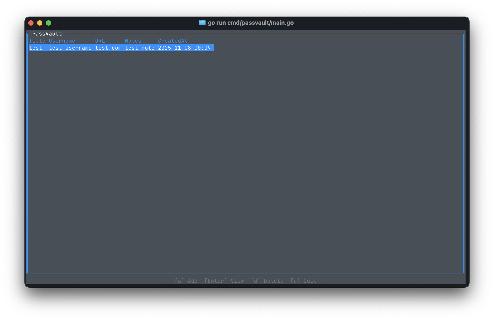
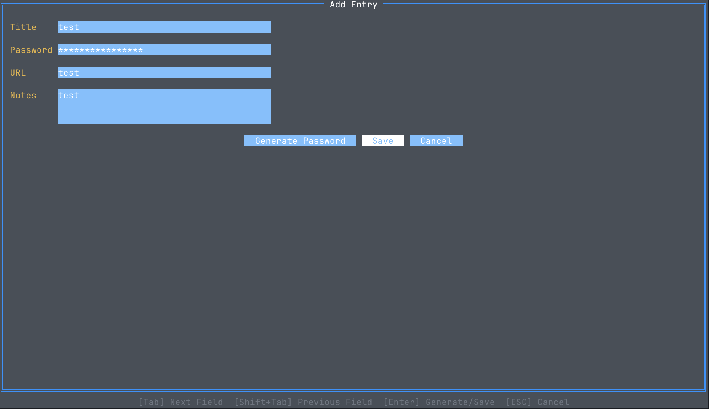
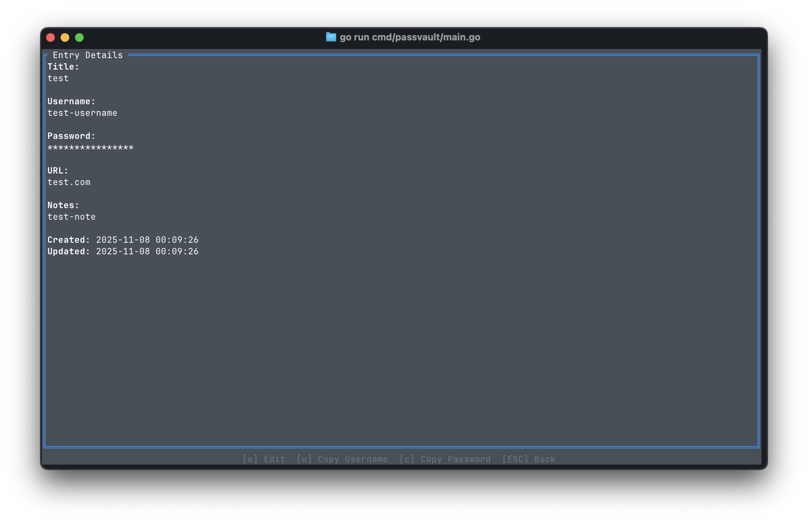

# PassVault

A password management TUI application

## Install

### Prerequisites

- Go 1.25.1 or higher

### Installation

```bash
$ git clone https://github.com/ritarock/passvault.git
$ cd passvault
$ go install ./cmd/passvault
```

## Usage

### First Run

On the first run, the encryption key and vault will be automatically generated.

```bash
passvault
```

Data is stored in the `~/.passvault/` directory.

### Basic Operations

Launch the application to display the TUI:

```bash
passvault
```

Available operations:

- List entries
- Create entry
- Update entry
- Delete entry
- Copy password to clipboard

### List View


### Create Entry


### Detail View

